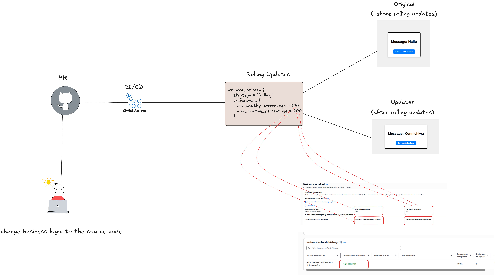
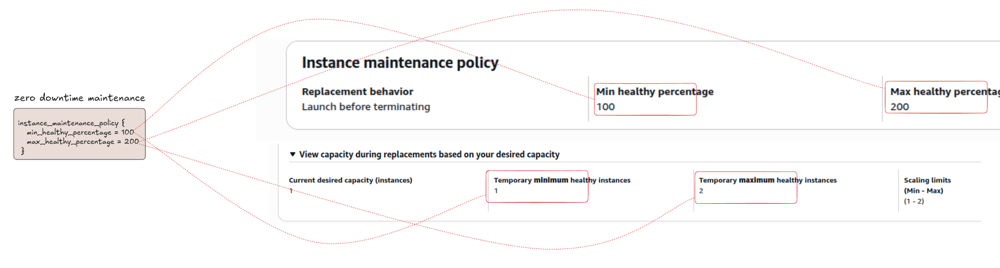

# End-to-End CI/CD Automation for React-Express App with HA, Fault Tolerance, and Zero Downtime Rollouts

##  CI/CD HLD of the project

## HA,Fault Tolerance & Zero Downtime Deployment Architecture on AWS LLD

## 🚀This project highlights🚀

- **Deployed a React-Express app with automated CI/CD via GitHub Actions.**

- **Automated the release process to ensure zero downtime during business logic updates**

- **Implemented dynamic scale-out and scale-in mechanisms driven by user activity.**

- **Ensured fault-tolerant architecture by distributing workloads across Availability Zones.**

- **Streamlined deployment by containerizing frontend and backend, improving speed and consistency.**

- **Built secure and efficient containers using rootless mode, multi-stage builds, and image optimization techniques.**

- **Containerized & push to private container registry and pull the image from it**

- **Deployed container images to a private registry with access control, allowing image pulls exclusively by authenticated entities.**

- **Using S3 Remote Backend to securly store state files and secure state management**

- **Achieved fully automated AWS deployment via Terraform, removing reliance on manual configuration steps.**

## Rolling Updates and Zero Downtime Deployment Strategy

## Future Improvements

- **HTTPS for secure user traffic.**

- **Plan to migrate deployment from public to private subnet to improve security and network isolation**

- **Intend to adopt Amazon EKS for future deployments to align with cloud-native best practices and streamline container management**